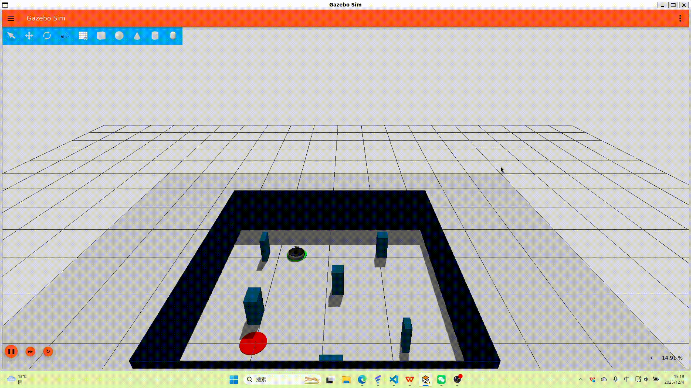

# A DRL framework for turtlebot4-lite

## Install wsl-ubuntu24.04
```
wsl --install Ubuntu-24.04
```
## Install ros2-jazzy
```
wget http://fishros.com/install -O fishros && bash fishros
source ~/.bashrc
```
## Install turtlebot4 plugin && Install python3-gz and tf-transformations && uv
```
sudo apt install ros-jazzy-turtlebot4-simulator ros-jazzy-irobot-create-nodes
sudo apt install ros-dev-tools
# Install Gazebo Harmonic
sudo apt-get install curl
sudo apt-get install lsb-release gnupg
sudo curl https://packages.osrfoundation.org/gazebo.gpg --output /usr/share/keyrings/pkgs-osrf-archive-keyring.gpg
echo "deb [arch=$(dpkg --print-architecture) signed-by=/usr/share/keyrings/pkgs-osrf-archive-keyring.gpg] http://packages.osrfoundation.org/gazebo/ubuntu-stable $(lsb_release -cs) main" | sudo tee /etc/apt/sources.list.d/gazebo-stable.list > /dev/null
sudo apt-get update
sudo apt-get install gz-harmonic
sudo wget https://packages.osrfoundation.org/gazebo.gpg -O /usr/share/keyrings/pkgs-osrf.gpg
echo "deb [arch=$(dpkg --print-architecture) signed-by=/usr/share/keyrings/pkgs-osrf.gpg] \
  http://packages.osrfoundation.org/gazebo/ubuntu-stable $(lsb_release -cs) main" | \
  sudo tee /etc/apt/sources.list.d/gazebo-stable.list
sudo apt update
sudo apt install libgz-transport14-dev python3-gz-transport14
sudo apt install libgz-msgs11-dev python3-gz-msgs11
sudo apt install ros-${ROS_DISTRO}-tf-transformations
curl -LsSf https://astral.sh/uv/install.sh | sh
source $HOME/.local/bin/env
```
## Create a venv from system packages and install other packages
```
uv venv --system-site-packages
source .venv/bin/activate
# source venv/bin/activate
uv pip install -r requirements.txt -i https://pypi.tuna.tsinghua.edu.cn/simple
```
## Compile and build your workspace
```
sudo rm -rf build install log
colcon build --symlink-install
source install/setup.bash
source install/local_setup.bash
source /opt/ros/jazzy/setup.bash
export GAZEBO_PLUGIN_PATH=/opt/ros/jazzy/lib
```
## Run code
```
ros2 launch turtlebot4_gz_bringup turtlebot4_gz.launch.py model:=lite world:=maze
python3 src/turtlebot4_rl/turtlebot4_rl/rl_node.py --timesteps 20000 --episodes 500
python3 src/turtlebot4_rl/turtlebot4_rl/rl_node.py --timesteps 5000 --episodes 2000 --algorithm SAC
tensorboard --logdir tensorboard_logs
```